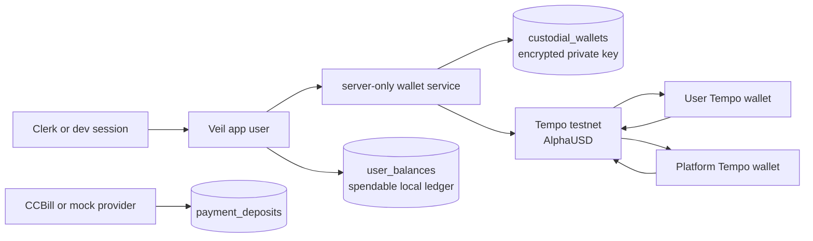
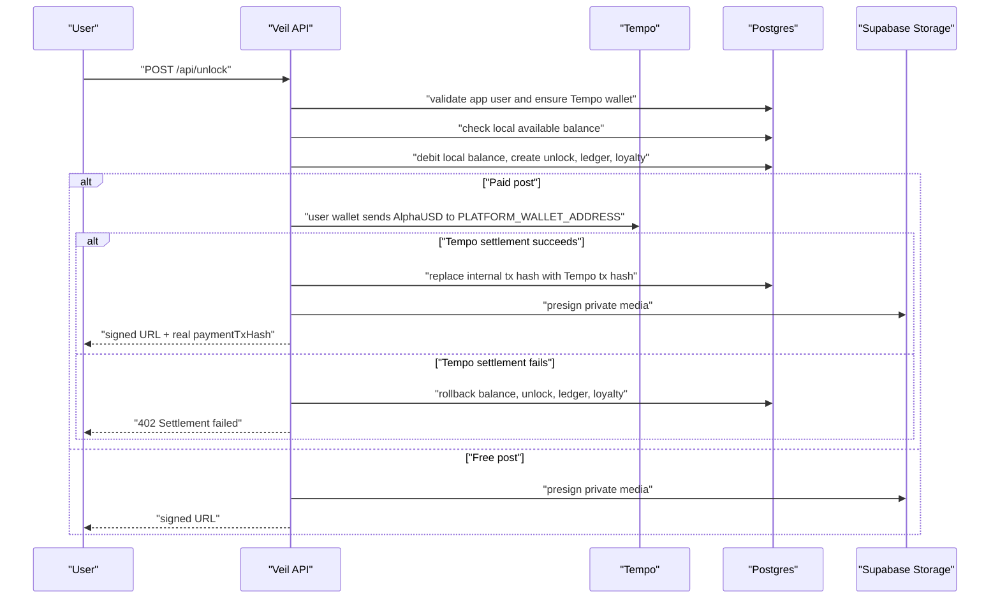

# Tempo Custodial Wallet Migration

## Target Architecture



Every registered user gets a server-custodial Tempo wallet. The private key is encrypted with `CUSTODIAL_KEY_ENCRYPTION_SECRET` and never leaves server-only modules. `users.walletAddress` remains a legacy/profile identity field; `custodial_wallets.address` is exposed as `tempoWalletAddress` and is the fundable wallet.

## Deposit Sequence

```mermaid
sequenceDiagram
  participant U as "User"
  participant A as "Veil API"
  participant P as "Payment Provider"
  participant T as "Tempo"
  participant D as "Postgres"

  U->>A: "POST /api/account/deposit"
  A->>D: "ensure user Tempo wallet"
  A->>D: "payment_deposits: pending + destinationWalletAddress"
  A-->>U: "checkout/session URL"
  P->>A: "provider success webhook or mock callback"
  A->>D: "payment_deposits: funding_pending"
  A->>T: "platform wallet sends amount + fee reserve to user wallet"
  alt "Tempo funding succeeds"
    A->>D: "payment_deposits: succeeded + tempoFundingTxHash"
    A->>D: "credit user_balances by deposit amount only"
  else "Tempo funding fails"
    A->>D: "payment_deposits: funding_failed"
    A-->>P: "accepted; local balance not credited"
  end
```

Deposit statuses now mean:

- `pending`: checkout/session created, provider has not succeeded.
- `funding_pending`: provider succeeded, platform wallet funding is in progress.
- `succeeded`: user Tempo wallet was funded and local balance was credited.
- `funding_failed`: provider succeeded, but platform funding failed; local balance was not credited.
- `failed`, `refunded`, `chargeback`: provider failure/reversal states.

## Unlock Sequence



Paid unlocks require a Tempo transfer from the user custodial wallet to `PLATFORM_WALLET_ADDRESS`. Free unlocks remain local and skip Tempo settlement.

## Required Environment

```bash
DATABASE_URL=postgres://...
CUSTODIAL_KEY_ENCRYPTION_SECRET=<base64 32-byte key>
PLATFORM_PRIVATE_KEY=0x...
PLATFORM_WALLET_ADDRESS=0x...
TEMPO_RPC_URL=https://...
TOPUP_PROVIDER=mock
USER_WALLET_FEE_RESERVE_USD=0.10
```

Generate a local custody secret:

```bash
openssl rand -base64 32
```

Apply schema changes:

```bash
npm run db:push
```

Backfill wallets:

```bash
npm run tempo:wallets:migrate -- --backfill-wallets
```

Reset local/dev fake ledger state:

```bash
npm run tempo:wallets:migrate -- --reset-test-ledger
```

Run both for a clean local migration:

```bash
npm run tempo:wallets:migrate -- --backfill-wallets --reset-test-ledger
```

`--reset-test-ledger` refuses production when `NODE_ENV=production` unless `ALLOW_TEST_LEDGER_RESET=true`.

## Migration Runbook

1. Set `CUSTODIAL_KEY_ENCRYPTION_SECRET`, `PLATFORM_PRIVATE_KEY`, `PLATFORM_WALLET_ADDRESS`, `TEMPO_RPC_URL`, and `USER_WALLET_FEE_RESERVE_USD`.
2. Run `npm run db:push` to add `funding_pending` and `funding_failed`.
3. Run `npm run tempo:wallets:migrate -- --backfill-wallets`.
4. For local/dev only, run `npm run tempo:wallets:migrate -- --reset-test-ledger`.
5. Restart the Next.js dev server so new env vars are loaded.
6. Sign in or use the dev login bypass; confirm `/api/user` returns `tempoWalletAddress`.

Production balances should not be reset. If production already has non-test balances, reconcile them separately before enabling mandatory paid unlock settlement.

## Failure And Retry Behavior

- Missing or invalid `CUSTODIAL_KEY_ENCRYPTION_SECRET` blocks wallet creation.
- Provider success moves a deposit to `funding_pending` before chain funding.
- If platform funding fails, the deposit moves to `funding_failed` and no local balance is credited.
- Retrying a `funding_failed` deposit through the same finalization path moves it back to `funding_pending` and attempts platform funding again.
- Paid unlock settlement failure rolls back the local debit, unlock row, ledger row, and loyalty row.
- Existing already-unlocked posts return the existing unlock and do not re-settle.
- Tempo memos remain 32 bytes and use `topup:<deposit>` and `unlock:<internal-ref>` prefixes.

## Manual Testnet Checklist

- Run `npm run db:push`.
- Run `npm run tempo:wallets:migrate -- --backfill-wallets --reset-test-ledger`.
- Sign in as the dev user.
- Confirm `/api/user` returns `tempoWalletAddress`.
- Start and complete a mock deposit.
- Confirm `/api/account/payments` shows `funding_pending` then `succeeded` with `tempoFundingTxHash`.
- Verify AlphaUSD arrives at `tempoWalletAddress` on the Tempo explorer.
- Unlock a paid post.
- Verify AlphaUSD transfers from the user wallet to `PLATFORM_WALLET_ADDRESS`.
- Confirm the collection includes the unlocked post and local balance decreased.
